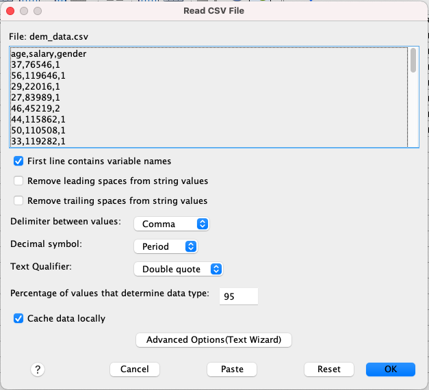
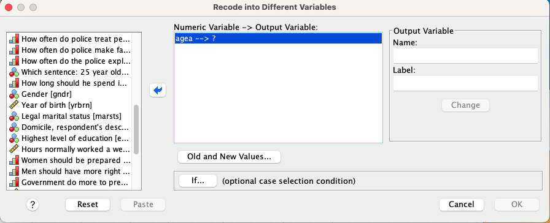
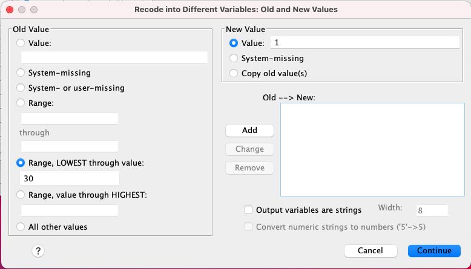
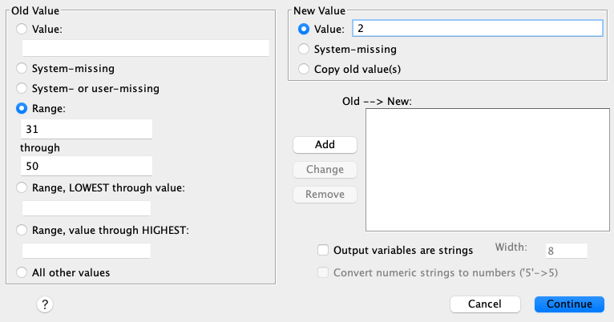
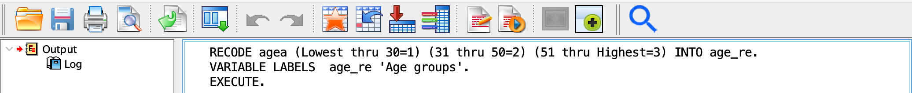
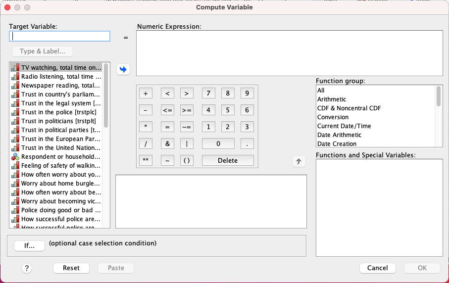

# DSL SPSS 

## Part I: Foundations of data management 

Hello and welcome to the first SPSS workshop from the Digital Skills Lab at LSE. It is the first out of four workshops that will enable you to gain fundamental skills of working with SPSS. 
This session is dedicated to the fundamentals of data management. By the end of this session, you will learn how to:

- open existing SPSS datasets
- work with SPSS interface
- import data from CSV and Excel files to SPSS
- process imported datasets
- recode variables
- compute new variables

It may sound like a lot, but it will take less than it seems. Let’s go through them one by one. 

## Table of Contents

- [Opening SPSS datasets](#spss_data)
- [SPSS interface](#interface)
- [Importing data from CSV and Excel](#csv_data)
- [Recoding variables](#recoding)
- [Computing variables](#computing)

### Opening SPSS datasets 

There is a high chance that you will be using a dataset that is already saved in the SPSS format, so you do not need to do any preprocessing and can use the file straight away. SPSS uses `.sav` extensions, and, for instance, the file that we will be using for our workshops is called **ESS5GB.sav**. This comes from the ESS ([European Social Survey](https://www.europeansocialsurvey.org), which is used in a lot of research (and may be useful in yours). We simply downloaded these data from the ESS site in the SPSS format. 

You can use this file now. Simply double-click the **ESS5GB.sav** and wait till it loads (it might take some time). Once it is open you will see two windows opened:

1. **The data editor**
This window is for you to access your data, manipulate it and look through it.
2. **The output**
This is an output window. SPSS warnings, messages, and (what's important) all the results of your operations will be shown in this window.

We will now explore the first one a little more thoroughly. The output window will be most relevant once we start conducting some analysis. 

### SPSS interface 

Let's explore the interface of the data editor window. You should see something similar to this:

You can see two buttons at the bottom of this window that says: "Data View" and "Variable View". Go ahead and click on the first one. 

### Data View

It opens a data view of your dataset. Here you can see and manually change all the observations. You can think of that as an Excel spreadsheet, where each row represents one observation (for instance, a person you surveyed) and each column is a variable that stores some information about those observations (for instance, the age of your respondents or their salary). 

### Variable View

Let's now click on "Variable View" at the bottom of this window and explore it. This section stores information on the variables that you have in your dataset. Each variable has several characteristics. We provided comments on some of the most used ones. You will use this information for the challenge below.

1. **Name** - the name of the variable 
> It is usually a code short name for a variable. An explanation of what it stores is usually in **Label**.
2. **Type** - a data type of the variable. The way it stores information (e.g., numbers, texts, dates, etc.)
3. **Width** - the length of a value displayed (e.g., a number of digits, a string length)
4. **Decimals** - the number of decimals used after a decimal point
5. **Label** - a label that describes what the variable stores
> This is where you would store an elaborate description of what this variable contains. 
6. **Values** - all possible values that this variable can take
> This parameter is used for categorical variables. If you double-click the values box for a variable you will see a button with 3 dots:
 
> After clicking on this button you will see a new window. In this window, you can create new values for a categorical variable. For instance, you can create a variable that records whether a person is left or right-handed. You would create a value 1 and label it as "right-handed" and value 2 and label it as "left-handed". To do that you will need to create a value and a corresponding value in the window that opened and click "Add".
7. **Missing** - the codes for missing values (for instance, people can code 997 as a rejection to answer and 999 no answer.)
9. **Columns** - the width of each column in the Data View window
10. **Allign** - the allignemnt of cells' content
11. **Measure** - a type of measurement that variable uses, can be Scale, Ordinal and Nominal 
> This is one of the key parameters of a variable that defines how SPSS will treat it. Failing to correctly identify a type of measurement can result in wrong calculations. There are three types of variables used in SPSS:
> 1. **Scale** Scale variables or so-called interval variables imply that there is an interval and a variable can take any value in this interval. For instance, temperature or age. You can be 30 years old, you can be 30,5 years old, but also it is definitely possible that you are 30.003 years old. The same applies to temperature, height, years of education, and so on. 
> 2. **Ordinal** An ordinal variable implies creating separate categories that are somehow **ordered/ranked**. For instance, if you have a variable that stores people's highest achieved level of education, where 1 is High School, 2 is a Bachelor's degree and 3 is a Master's degree. They are all ranked: each one is higher than the next one. 
> 3. **Nominal** A nominal variable implies creating categories that are **NOT** in any way **ranked**. For instance, right and left-handed people are two categories. These categories do not have any order/hierarchy. 
12. **Role** - the role of the variable in your analysis

---

### Challenge 1: Creating variables

Now it's time for your first challenge! Go to the **Variable View** and create 3 variables (to do it simply scroll down all the variables and click on the first empty row in **Variable View**):

1. **Name**: height, **Label**: Person's height, **Values**: None (as it's a scale variable), **Measure**: Scale (To change the Measure, simply click on the corresponding cell)
2. **Name**: pln_class, **Label**: Plane ticket class, **Values**: 1-First, 2-Second, 3-Third, **Measure**: Ordinal
3. **Name**: fav_col, **Label**: Favorite colour, **Values**: 1-Red, 2-Green, 3-Blue, **Measure**: Nominal

---

### Importing data from CSV and Excel 

Now when you have a basic understanding of how SPSS looks and works, we can take one step further and explore how to import spreadsheets into SPSS. During the years of teaching SPSS, we encountered a question of how to import `.csv` or `.xlsx` files into SPSS. Indeed, it's a very useful skill, because a lot of datasets are stored as Excel or CSV (Comma-Separated Values) files. To do that go to `SPSS -> File –> Import Data -> ...`

1. **Excel**

Let's consider our example. Go to `SPSS -> File –> Import Data -> Excel` and let's import a file called `dem_data.xlsx`. You should see this window after selecting this file and clicking "Open":

You can see that you can select a sheet from which to read the data and then we have several parameters that are quite straightforward. Let's click "OK" once we are satisfied with our settings. Now go to the variable view and look at the **Measure** settings SPSS used. Are they correct? 

2. **CSV**

Now let's take the same file but save it as a CSV file. Go to `SPSS -> File –> Import Data -> CSV` and let's import a file called `dem_data.csv`. Now after clicking "Open" we will see a different window:

When importing CSV one should be careful, because **columns are separated by a special symbol** (usually a comma). You can see in the preview of our data that they are indeed separated by commas, and we select it in our `Delimiter between values` parameter. For your own research also pay attention to how decimal points are marked (commas or periods in the `Decimal symbol` parameter). Let's click "OK" once we are satisfied with our settings. Are the **Measure** settings here are correct again?

3. **You can use other dataset types to import to SPSS using the same sequence of steps again**.

**Note** that you can open multiple datasets at the same time. Should you do so, pay attention to what dataset you are working at the moment. 

---

### Challenge 2: Correcting imported datasets

As your second task:

1. Import the `dem_data` in either Excel or CSV format
2. Check if the **Measure** settings are correct
3. Add labels to your variables, namely "Respondent's salary", "Age of a respondent", and "Gender" to corresponding variables
4. For the gender variables add values: 1 - Male, 2 - Female, 3 - Other (specified)

---

### Recoding variables 
 
Now as we learned how to open datasets and import them from other file formats we can finally work with data. The first thing to do with data is preprocessing, so in this section, we will take one step into that and learn how to **recode** variables. There are many cases when it may be useful. For instance, you want to group your respondents into age groups. You want to have those that are younger than 30, from 31 to 50 and 50 and older. To do that, we can use SPSS functionality. 

Let's use our **ESS5GB.sav** file again (you can close the imported ones). Let's take the following path `SPSS -> Transform –> Recode into Different Variables. Recoding into Different Variables will create new recoded variables compared to Recode into Same Variables that will **change the existing ones**. We choose the former in order to **avoid changing the original data**. Once you click on Recode into Different Variables you will see the following window:

> **Lifehack not to get lost in variables**
> You can see that there is an overwhelming number of variables in this dataset. No to get lost in them right-click in the area of variables (like in the picture below) and select `Display Variable Names` and `Sort Alphabetically. This way you will have short names ordered in a nice order.

We will be working with a variable called `agea` (Age of respondent...). Find and click on this variable (it will be highlighted in blue) and click on the blue arrow in the middle of the window so it moves to the box on the right like this:

As you can see, it now shows `agea ---> ?` which means that SPSS wants you to name a new variable with recoded values. In order to do that provide it with a new name in the `Name` box in the `Output variable area` on the right. Let's call it `age_re` and give it a label of "Age groups". Don't forget to click **Change** once you have given all the details of the new variable. Now all the recoded values will be stored in `age_re`.

Now it's time for the actual recoding. Click on the **Old and New Values...** button to create recoding rules. Once you click it you will see a new window. In this window, we can create rules for recoding. First, let's create group 1 that is aged 30 and below. For that let's set these settings here:

Once you input the values, find the **Add** button and click it. It should show a new line in the `Old --> New` box. If it did, you did everything correctly. Now let's create group 2 aged 31 to 50 like this. 

Don't forget to click **Add** again for that one. The last group will be the ones 51 and older. We can do it like this:

Perfect! Now we can click **Continue** in this window and the next one. Once you did it SPSS will navigate you to the **Output** window that should look somewhat like this:

In this window, SPSS will show you what code it executes. In this case, it basically told us:

> *Hey! I recoded the agea variable into age_re using the rules you provided it and labeled it "Age groups".*

Go ahead and check whether the values are recoded correctly by switching to **Data View* and exploring the values of `agea` and `age_re`. 

---

### Challenge 3: Recoding a variable

There are several variables evaluating trust in the ESS5GB.sav data. Each measure trust from 0 (No trust) to 10 (Complete trust). Take the variable `trstprl` (Trust in country's parliament) in ESS5GB.sav and recode it into a new variable with 3 categories:

1. Low trust: Values from 0 to 4
2. Moderate trust: Values from 5 to 7
3. High trust: Values from 8 to 10

Not only create new categories as 1,2 and 3, but label them as Low, Middle, and High trust in the **Variable view**. 

---

### Computing variables 

Good job! We are almost done for today! The last part of our today's session is dedicated to calculating new variables. You might need it, for instance, when you are creating indices and want to give different weights to different variables. Let's consider an example.

We have several variables evaluating trust in political institutions. Let's say we wanted to calculate some indicators of the trust in the local institutions: parliament, legal system, and police. Let's calculate the mean of all of them for each person. To do that we would go to `SPSS -> Transform –> Compute Variable`. You will see something like this:

In this window, we can create variables that are a product of calculations and use other variables. Let's create a new one called `trst_local` (put it in the **Target variable** box). You can then see a small equality sign and a **Numeric expression** box. In this box, you can provide a formula to compute your new variable. You can use simple maths operations, but also can use functions. 

> You can explore all functions by clicking **All** in the **Function group** box on the right. All the functions will appear in the **Functions and Special Variables** box.

For instance, in our case, we need a function called `MEAN()`. In the brackets, we will give our variables that we want to find a mean of, namely trstprl, trstlgl, trstplc. In the end, we should get something like this:

Go ahead, click **OK**, and check whether it actually conducted the calculation.

---

### Final Challenge: Computing a variable

The final task! Using `SPSS -> Transform –> Compute Variable` create a new variable called `trst_tot` that will be a sum of all trust variables in the database. 

---