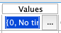

# DSL SPSS 

## Part I: Foundations of data management 

Hello and welcome to the first SPSS workshop from the Digital Skills Lab at LSE. It is the first out of four workshops that will enable you to gain fundamental skills of working with SPSS. 
This session is dedicated to the fundamentals of data management. By the end of this session, you will learn how to:

- open existing SPSS datasets
- work with SPSS interface
- import data from CSV and Excel files to SPSS
- process imported datasets
- recode variables
- compute new variables

It may sound like a lot, but it will take less than it seems. Let’s go through them one by one. 

### Opening SPSS datasets

There is a high chance that you will be using a dataset that is already saved in the SPSS format, so you do not need to do any preprocessing and can use the file straight away. SPSS uses `.sav` extensions, and, for instance, the file that we will be using for our workshops is called **ESS5GB.sav**. This comes from the ESS ([European Social Survey](https://www.europeansocialsurvey.org), which is used in a lot of research (and may be useful in yours). We simply downloaded these data from the ESS site in the SPSS format. 

You can use this file now. Simply double-click the **ESS5GB.sav** and wait till it loads (it might take some time). Once it is open you will see two windows opened:

1. **The data editor**
This window is for you to access your data, manipulate it and look through it.
2. **The output**
This is an output window. SPSS warnings, messages and (what's important) all the results of your operations will be shown in this window.

We will now explore the first one a little more thoroughly. The output window will be most relevant once we start conducting some analysis. 

### SPSS interface

Let's explore the interface of the data editor window. You should see something similar to this:

You can see two buttons at the bottom of this window that say: "Data View" and "Variable View". Go ahead and click on the first one. 

### Data View

It opens a data view of your dataset. Here you can see and manually change all the observations. You can think of that as an Excel spreadsheet, where each rows represents one observation (for instance, a person you surveyed) and each column is an variable that stores some information about those observations (for instance, age of your repsondents or their salary). 

### Variable View

Let's now click on "Variable View" at the bottom of this window and explore it. This section stores information on the variables that you have in your dataset. Each variable has several characteristics. We provided comments on some of the most used ones. You will use this information for a challenge below.

1. **Name** - the name of the variable 
> It is usually a code short name for a variable. An explanation of what it stores is usually in **Label**.
2. **Type** - a data type of the variable. The way it stores information (e.g., numbers, texts, dates, etc.)
3. **Width** - the lenght of a value displayed (e.g., a number of digits, a sting length)
4. **Decimals** - the number of decimals used after a decimal point
5. **Label** - a label that describes what the variable stores
> This is where you would store an elaborate description of what this variable contains. 
6. **Values** - all possible values that this variable can take
> This parameter is used for categorical variables. If you double-click the values box for a variable you will see a button with 3 dots:

> After clicking on this button you will see a new window. In this window you can create new values for a categorical variable. For instance, you can create a variable that records whether a person is left or rigt-handed. You would create a value 1 and label it as "right-handed" and value 2 and label it as "left-handed". To do that you will need to create a value and a corresponding value in the window that opened and click "Add".
7. **Missing** - the codes for missing values (for instance, people can code 997 as a rejection to answer and 999 no answer.)
9. **Columns** - the width of each column in the Data View window
10. **Allign** - the allignemnt of cells' content
11. **Measure** - a type of measurment that variable uses, can be Scale, Ordinal and Nominal
> This is one of the key parameters of a variable that defines how SPSS will treat this variable. There are three types of varibales used in SPSS:
> 1. **Scale** Scale varibales 
> 2. **Ordinal** An ordidinal variable implies creating seprate categories that are somehow ordered/ranked. For instance, if you have 
> 3. **Nominal** A nominal variable implies creating categories that are **NOT** in any way **ranked**. For instance, right and left handed people are two categories. These categories do not have any order/hiearchy. 
12. **Role** - the role of the variable in your analysis

### Challenge 1: reating variables

### Importing data from CSV and Excel

Now when you have a basic understanding of how SPSS looks and works, we can take one step further and explore how to import spreadsheets into SPSS. During the years of teaching SPSS we encountered a question of how to import `.csv` or `.xlsx` files into SPSS. Indeed, it's a very useful skill. To do that go to SPSS -> 

