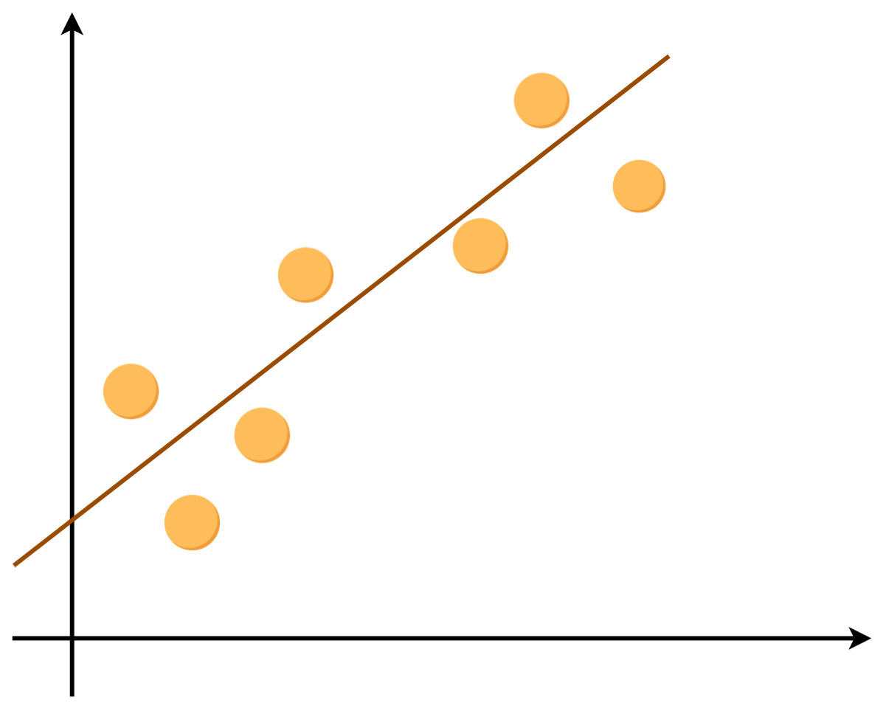

# DSL SPSS 

## Part IV: Regression analysis

Welcome to the fourth SPSS workshop from the Digital Skills Lab at LSE.

In the last session, you have learned about inferential statistics. Now, it's time to take a step further and explore one of the most widely used data analytics tools **regressions**. Regressions allow you to (1) make inferences about associations between variables, (2) predict variables' values. By the end of this session, you will learn how to:

- run correlations
- build scatter plots
- build simple and multiple linear regressions
- make predictions with linear regressions
- use categorical variables in regressions
- build logistic regression models

We hope you will enjoy this workshop!

## Table of Contents

- [Introduction to regression](#intro)
- [Simple linear regression](#simple)
- [Multiple linear regression](#multiple)
- [Dummy variables](#dummy)
- [Logistic regression](#logistic)
-  [Predictions with regression](#pred)

## Getting started

We will be using a new dataset today. It's a dataset containing information about different cars sourced from ([Kaggle](https://www.kaggle.com/hellbuoy/car-price-prediction)). The data file that you will be using today is called **cars.sav**. 

Open this file now, either by double-clicking on the file in Finder (Mac) or Windows Explorer, or using *file -> open -> data* in SPSS. 

Follow the example steps provided, then have a go at the challenges for each section. 

## Introduction to regression 

Linear regressions are arguably the most popular data analysis tool in the world. People like it and use it a lot when they wish to understand relationships between variables. The idea behind **any** regression task is to predict a continuous numerical variable. In other words, we wish to understand an association between one or more **predictors** (other names: independent variables, features) and a continuous **response variable** (other names: dependent variable, target variable). 

Let's consider an example. You want to earn a lot of money and you are trying to understand what qualities you need to possess to achieve that. Your income is a continuous and numeric variable. Ideal! It means that we can run a regression model and understand what predicts people's salaries. It can be their education, their gender, number of Facebook friends, and so on.

💡 Stop for a second and think what are the predictors and what is the response variable in this example. 

In our today's session, we are discussing **linear** regressions. They are called linear because they spot linear relationships between variables. Without going into much maths linear regressions aim to build a linear function that can explain a relationship between a variable and a response variable. Hence it will work well if data looks like this:

and will perform poorly if data looks like this:

If you wish to understand regression in more detail we would recommend this [youtube video](https://www.youtube.com/watch?v=nk2CQITm_eo). It explains the algorithm and a bit of maths behind linear regression models. 

## Simple linear regression 

We will start our journey from the most basic model called **simple linear regression**. Simple linear regression is a kind of linear regression that uses only one predictor. In our today's session, we will be working with a dataset that contains information about different cars. We will be trying to understand what characteristics of a car predict its **price** in the best way. 

As we are building a simple linear regression we need to select **one** predictor (independent variable) that we will use to predict car prices. For now, we will be using only continuous variables to predict the car price. To understand which one to select for our model we will do two important things:

1) Calculate correlation coefficients between variables and the car price  

You can do it by going to `SPSS -> Analyze –> Correlate -> Bivariate`. For all variables that you put into the **Variables** box, SPSS will compute pairwise correlations. The output of this will be a symmetric correlation matrix. As we do not need to see it fully we can tick the **Show only the lower triangle** box and click **OK**. Once you click **OK** you will see a table. For each pair of variables, it shows (1) the correlation coefficient, (2) the significance level, (3) the number of observations used to calculate the coefficient. Also, SPSS will mark those coefficients that are significant with asterisks. One asterisk means the correlation is significant at the **0.05 level**, two asterisks that it is significant at the **0.01 level**.
 
2) Plot variables against car prices in a scatter plot

You can create scatter plots in two ways: 
 - `SPSS -> Graphs –> Legacy Dialogs -> Scatter/Dot... -> Simple Scatter`. After you see a new window you can put the needed X and Y variables. However, in the case of building regressions, it might be tedious to build those scatter plots one by one for each variable. That's why we suggest another method below.
 - `SPSS -> Graphs –> Regression Variable Plots`. In the new window, we would recommend putting a dependent variable into the **Vertical-Axis Variables** and potential predictors into the **Horizontal-Axis Variables**. Once you click **OK** it will show you scatter plots of all your variables plotted against your dependent variable. 

---

### Challenge 1: Choosing a predictor

- Find pair-wise correlations of all continuous variables in this dataset. What variables are associated with the car price?
- Plot all continuous variables against the car price. What variables are **linearly** associated with the car prices? Discuss it in the group. 

---

After completing the challenge you might notice that several variables are associated with the car price. However, some of the associations will not work well with linear regression. Take a look at the `highwaympg` variable (*Mileage on highway*) plotted against car price. 

You will notice that the relationship is **not** linear. It's somewhat quadratic. Hence, building a linear regression model with *Mileage on highway* would be a bad idea as we assume linearity in this model. 

💡 Can you spot a variable that is linearly associated with the car price?

Once we decided on the predictor that will be used we can finally build our model. To do that go to `SPSS -> Analyze –> Regression -> Linear...`. In the new window you can put your dependent variable in the **Dependent:** box and all predictors into the **Independent(s)** one. The default settings will do the job for now, but you can always experiment with your model and the output. Once you click **OK** you will see several tables. **Model Summary** contains some quality metrics of the model including R2. **ANOVA** will show you the RSS and F-statistics. **Coefficients** shows the coefficients of the model including the intercept (Constant). 

---

### Challenge 2: Your first model

After examining the scatter plots that you have built in the last challenge you might have noticed that `enginesize` (*Size of engine*) is linearly associated with the car price. Go ahead and build a simple linear regression model using `enginesize` as a predictor. What do you find? 

---

We will not go into much detail here as it is beyond the scope of this course, but here is a brief explanation of some of the numbers in those tables:

**R2** - the share of variance of the dependent variable "explained" by the independent variables, i.e., to what extent the chosen predictors explain the changes in the dependent variable.

**Constant** (intercept) - the expected value of the dependent variable if all predictors are equal to zero.

**Coefficients** show the change of a dependent variable if the independent variable changes by 1 unit. In our example, the unstandardized coefficient for the engine size will show the car price will increase on average by 167.698, if you increase the size of the car engine by 1 unit.

## Multiple linear regression 

Multiple linear regression is a type of linear regression where we use more than one predictor. In SPSS it is done in a very similar manner by simply putting more variables into the **Independent(s)** box in the regression window. However, you might wish to change one thing there and run collinearity diagnostics. Multicollinearity is a phenomenon of predictors' associations in-between each other. 

To add collinearity diagnostics go to `SPSS -> Analyze –> Regression -> Linear...`, add all the variables that you want to the **Independent(s)** box. Then, click on **Statistics** and tick the box for **Collinearity diagnostics**. Once you click **Continue** and then **OK** you will see that now in the *Coefficients* table there are two new columns: *Tolerance* and *VIF*. The rule of thumb here is that if all the values in the VIF column are below 10, you are not experiencing multicollinearity. If you do, we would recommend running correlations between all the variables to find associated ones. We can also recommend to explore [this video](https://www.youtube.com/watch?v=IRVd4m8ulHs&t=210s) on how to read collinearity diagnostics in SPSS in more detail 

---

### Challenge 3: More predictors

Now it's time for more predictors! Using the scatter plots that you have built find at least 2 more variables that are associated with the car price. Add them to the model and explore the results. 

---

When interpreting coefficients for the multiple linear regressions do remember that a coefficient shows a change of a dependent variable if the independent variable changes by 1 unit *holding all the other independent variables constant*. The last part is very important as we must see these coefficients as being independent of others. 

## Creating dummy variables 

Dummy variables are *artificial* variables that take values of 0 or 1 to indicate the absence or presence of something.

>- 0 = absent
- 1 = present 

This is very useful in regressions, which treat all independent variables as numerical. There are some different approaches to making dummy variables, depending on what data we have and what we want to do. 

First, we can take a numerical variable and make it a dummy variable depending on a certain condition. For example, if we were interested in knowing which participants were over a certain age, we can make a dummy variable to tell us who is and isn't; 1 means they are over 25 and 0 means they are under 25. 

| **Age**    | **over_25**  |
|------------|--------------|
| 26         | 1            |
| 49         | 1            |
| 19         | 0            |
| 17         | 0            |
| 56         | 1            |

Second, if we have a categorical variable with more than two levels, we create multiple dummy variables to "replace" the original variable. By convention if you have two or more variables, one variable is not coded so we have a comparison point. For example, if we give people a choice of three ice cream flavours and they tell us their favourite (Vanilla, Chocolate, or Pistachio), we would make two dummy variables. In the table below we have used vanilla as our comparison point with dummy variables for pistachio and chocolate.

| **Favourite\_ice_cream** | **dummy_pistachio** | **dummy_chocolate** |
|-------------------------|---------------------|---------------------|
| Vanilla                 | 0                   | 0                   |
| Chocolate               | 0                   | 1                   |
| Pistachio               | 1                   | 0                   |
| Vanilla                 | 0                   | 0                   |
| Vanilla                 | 0                   | 0                   |
| Chocolate               | 0                   | 1                   |

How do we create dummy variables in SPSS? We go to `Transform -> Compute Variable`. Target Variable is the name we call our dummy variable. Numeric expression is the condition we set to calculate our dummy variable. In the image below we call our dummy `dummy_var` and make it with a condition `variable >= 25`. 

The green box shows the *conditional operators*, which allow us to make conditional statement. The table below shows what each of these mean. 

| **Conditional operator** |        **Meaning**       |
|:------------------------:|:------------------------:|
|             <            |         Less than        |
|             >            |       Greater than       |
|            <=            |   Less than or equal to  |
|            >=            | Greater than or equal to |
|             =            |         Equal to         |
|            ~=            |       Not equal to       |

### Challenge 4: Make dummy variable

We will make some dummy variables to use in our logistic regression. 

First we want to make a dependent variable. Like our linear regression we will use price as the dependent variable, but we will make a dummy to tell us which cars are expensive; we can do this many ways but for this exercise we will classify *expensive* cars as any over the mean price of all the cars.

>The mean price is 13276 dollars, we can round this to 13500 dollars

1. Make a variable called dummy_price, where car prices that are greater than or equal to 13500 become 1 (expensive cars)

Next, we are interested in if type of wheel drive effects price of the car. We will need to make the `drive_wheel` variable into two dummy variables: one for rear wheel drive and one for four wheel drive, our comparison variable will be front wheel drive. 

| **Drive** | **Number** |
|:---------:|:----------:|
|four       | 1          |
|front      | 2          |
|rear       | 3          |

2. Make dummy variables called `dummy_rear_wheel` (all rear wheel cars become 1) and `dummy_four_wheel` (all four wheel cars become 1). Use the table above for reference

3. Go to the variable view and add values to your `dummy_sales` variable. Values of 0 should be *normal* and 1 should be *expensive* 

4. Finally, check all of your dummy variables have performed their calculations correctly. For example, row 1 should have 0 for `dummy_price`, 1 for `dummy_rear_wheel`, and 0 for `dummy_four_wheel`

## Binary Logistic regression 

Binary Logistic regression is like linear regression but the dependent variable (DV) has two categories such as present and not present.  If your data isn't already set up to have a binary dependent variable, that is when we make a dummy variable like we did in the previous chapter.  

To run a binary logistic regression in SPSS we go to `Analyse -> Regression -> Binary logistic`. The dependent variable (called Dependent in SPSS) is your binary variable. Your independent variables go into the section called block. 

As an example, we might be interested in understanding if mileage in the city and mileage on the highway are good predictors for the fuel system of a car. We can run a logistic regression with fuel system as our dependent variable, and mileage in city and mileage on highway as our independent variables.  

When you run a logistic regression in SPSS you get a lot of outputs. We are most interested in the section that is *Block 1*. See the image below from the output of our example logistic regression.

>It is important to note diesel fuel system is our comparison point, which means our model will try to determine if a car is, or is not, a diesel fuelled car. 

The first thing we can note is both independent variables in our model are significant (see `Sig.` the *Variables in the Equation* table). This means there is likely a relationship between these two variables and the fuel system of a car. 

The blue box shows the model summary with the pseudo R squared, which measures how much variance is explained by the model. It is easier to use the *Nagelkerke R Square*, which has a range of 0-1. In our example, with 0.228 suggests a small amount of variance is explained. 

The red box shows the coefficients, which means for every one unit increase in the variable the model predicts an increase/decrease in the log odds by the value of *B*. We see that milage in city decreases the log odds of being a diesel fuel car by -0.59 units, whereas mileage on highway increases the log odds of being a diesel fuel car by 0.46. 

The green box shows the odds ratios, that give us the odds of falling into target group or not; in our example the target group is diesel, and non-target is gas. Mileage in city odds ratio is 0.55 suggesting cars with good city mileage are 0.55 times less likely to be diesel. Mileage on highway shows the opposite, cars with good highway mpg are 1.5 times more likely to be diesel. 

>To summarise: 
> 
>* 1 or near 1 means odds of falling into target group equal to falling into non-target group  
* Greater than 1 means odds of falling into target group are greater than falling into non-target group  
* Less than 1 means odds of falling into target group are less than falling into non-target group  

Finally, the classification table tells us how good is our model at predicting the fuel system. The overall percentage tells us our model has 89.8% accuracy. 

For extra information explaining logistic regression, have a look at [this helpful video (8 minutes long) after the workshop](https://www.youtube.com/watch?v=yIYKR4sgzI8). 

### Challenge 5: Run logistic regression

Run a logistic regression using your `dummy_price` variable as your dependent variable.

Use the independent variables you used in your multiple linear regression as well as the two dummy variables you just made: 

* `dummy_rear_wheel`
* `dummy_four_wheel`

Discuss with the person next to you or in your breakout room: 

* How much variance is explained? 
* Which variables are significant? 
* Of those significant variables, what do the coefficients and log odds mean?  

What is your hypothesis on what outcome you are expecting? Do your results allow you to reject or accept the null hypothesis?

## Predictions with regression 

One of the useful features of linear regression is to use it to make predictions on future data. We do this by using the linear regression equation and the *constant* outputs of our regression model. 

**Simple linear regression equation**  
$Y_i$ = $\beta$0 + $\beta$1$X_i$

>In english: Y equals Constant (dependent variable) + Independent variable

As an example we can use our simple linear regression model from earlier. Say we wanted to find out the estimated price of a car with an engine size of 150, our equation would look like:

Our equation would like something like this:

Y = Constant + (engine size coefficient * 150)

Then we add in the coefficient values, our full equation looks like this:

Y = -8005.446 + (167.698 * 150)

Y (estimated price of car) = 17149.25

---

**Multiple linear regression equation**  
$Y_i$ = $\beta$0 + $\beta$1$X_i$ + $\beta$2$X_i$ + $\beta$3$X_i$

>In english: Y equals Constant (dependent variable) + first Independent variable + second Independent variable + third Independent variable

For our multiple linear regression, if we used engine size, horsepower, and weight (no baggage), and we wanted to know the price of a car that had:

* engine size of 150
* weight of car (no baggage) of 3000
* horsepower of 150

Our equation would like something like this:

Y = Constant + (engine size coefficient * 150) + (weight of car coefficient * 3000) + (horsepower coefficient * 150)

Then we add in the coefficient values, our full equation looks like this:

Y = -13463.789 + (84.880 * 150) + (4.263 * 3000) + (48.747 * 150)

Y (estimated price of car) = 19369.26

### Challenge 6: Make your own predictions with linear regression

Run a new multiple linear regression model with the following parameters:  

* **dependent variable**: Price of car
* **independent variables**: horsepower and engine size

Using the outputs from this model, and the formulas and examples above, try and predict the price of a car if:

* horsepower is 200
* engine size is 170

Now try to predict price if: 

* horsepower is 90
* engine size is 70

## Final challenge — complete the course survey

[Click this link to complete the survey](https://lse.eu.qualtrics.com/jfe/form/SV_ewXuHQ1nRnurTdY?coursename=SPSS%4:%Regressions%in%SPSS&topic=SPSS&prog=SR&version=22-23&link=)
