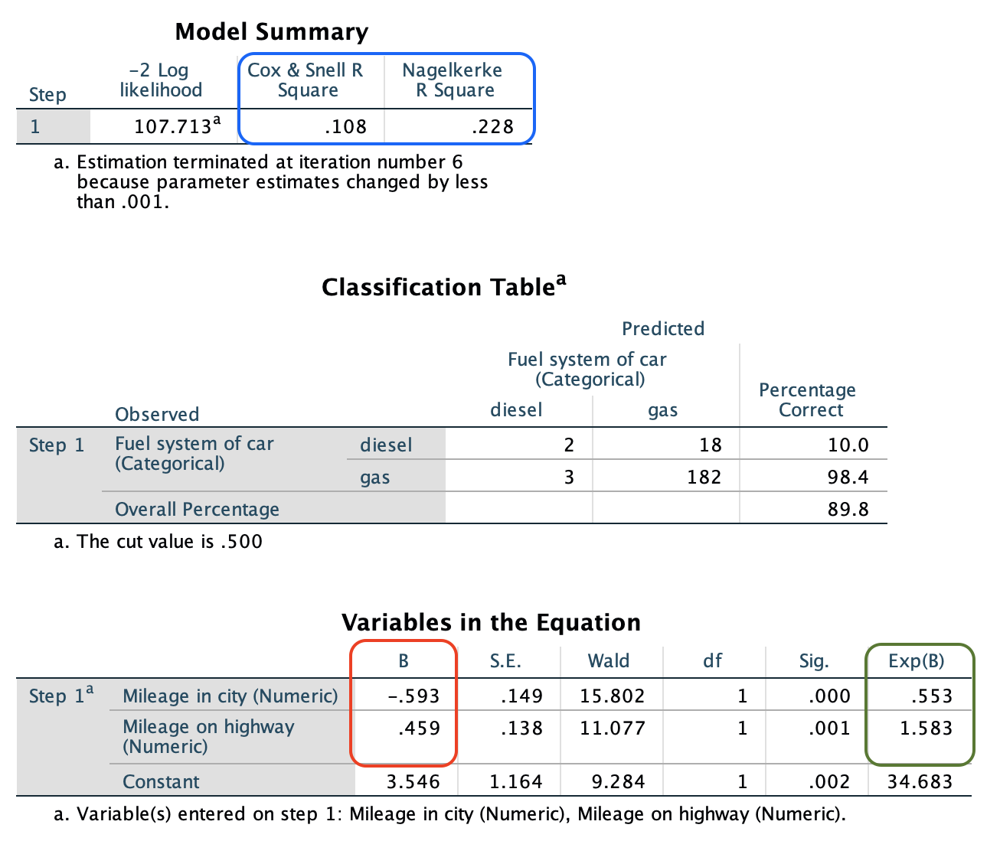

# DSL SPSS

## Part IIII: Regression

Welcome to fourth workshop

Previously we covered...

In this workshop you will cover...

## Table of Contents

- Introduction to regression
- Simple linear regression
- Multiple linear regression
- Predictions with regression
- Dummy variables
- Logistic regression

## Introduction to regression

What is regression? 

The equation and what it means

Run a correlation and a scatter plot. Do you see any trends in the data? 

### Challenge 1: Running a correlation and scatter plot

## Simple linear regression

Run regression

Make prediction

### Challenge 2: Run simple linear regression

### Challenge 3: Run multiple linear regression

Running a multiple linear regression follows similar principles to the simple linear regression. Try now to run....


## Creating dummy variables 

Dummy variables are *artificial* variables that take values of 0 or 1 to indicate the absence or presence of something.

>- 0 = absent
- 1 = present 

This is very useful in regressions, which treat all independent variables as numerical. There are some different approaches to making dummy variables, depending on what data we have and what we want to do. 

First, we can take a numerical variable and make it a dummy variable depending on a certain condition. For example, if we were interested in knowing which participants were over a certain age, we can make a dummy variable to tell us who is and isn't; 1 means they are over 25 and 0 means they are under 25. 

| **Age**    | **over_25**  |
|------------|--------------|
| 26         | 1            |
| 49         | 1            |
| 19         | 0            |
| 17         | 0            |
| 56         | 1            |


Second, if we have a categorical variable with more than two levels, we create multiple dummy variables to "replace" the original variable. By convention if you have two or more variables, one variable is not coded so we have a comparison point. For example, if we give people a choice of three ice cream flavours and they tell us their favourite (Vanilla, Chocolate, or Pistachio), we would make two dummy variables. In the table below we have used vanilla as our comparison point with dummy variables for pistachio and chocolate.

| **Favourite\_ice_cream** | **dummy_pistachio** | **dummy_chocolate** |
|-------------------------|---------------------|---------------------|
| Vanilla                 | 0                   | 0                   |
| Chocolate               | 0                   | 1                   |
| Pistachio               | 1                   | 0                   |
| Vanilla                 | 0                   | 0                   |
| Vanilla                 | 0                   | 0                   |
| Chocolate               | 0                   | 1                   |

How do we create dummy variables in SPSS? We go to `Transform -> Compute Variable`. Target Variable is the name we call our dummy variable. Numeric expression is the condition we set to calculate our dummy variable. In the image below we call our dummy `dummy_var` and make it with a condition `variable >= 25`. 


The green box shows the *conditional operators*, which allow us to make conditional statement. The table below shows what each of these mean. 

| **Conditional operator** |        **Meaning**       |
|:------------------------:|:------------------------:|
|             <            |         Less than        |
|             >            |       Greater than       |
|            <=            |   Less than or equal to  |
|            >=            | Greater than or equal to |
|             =            |         Equal to         |
|            ~=            |       Not equal to       |

### Challenge 4: Make dummy variable

We will make some dummy variables to use in our logistic regression. 

First we want to make a dependent variable. Like our linear regression we will use price as the dependent variable, but we will make a dummy to tell us which cars are expensive; we can do this many ways but for this exercise we will classify *expensive* cars as any over the mean price of all the cars.

>The mean price is 13276 dollars, we can round this to 13500 dollars

1. Make a variable called dummy_price, where car prices that are greater than or equal to 13500 become 1 (expensive cars)

Next, we are interested in if type of wheel drive effects price of the car. We will need to make the `drive_wheel` variable into two dummy variables: one for rear wheel drive and one for four wheel drive, our comparison variable will be front wheel drive. 

| **Drive** | **Number** |
|:---------:|:----------:|
|four       | 1          |
|front      | 2          |
|rear       | 3          |

2. Make dummy variables called `dummy_rear_wheel` (all rear wheel cars become 1) and `dummy_four_wheel` (all four wheel cars become 1). Use the table above for reference

3. Go to the variable view and add values to your `dummy_sales` variable. Values of 0 should be *normal* and 1 should be *expensive* 

4. Finally, check all of your dummy variables have performed their calculations correctly. For example, row 1 should have 0 for `dummy_price`, 1 for `dummy_rear_wheel`, and 0 for `dummy_four_wheel`

## Binary Logistic regression

Binary Logistic regression is like linear regression but the dependent variable (DV) has two categories such as present and not present.  If your data isn't already set up to have a binary dependent variable, that is when we make a dummy variable like we did in the previous chapter.  

To run a binary logistic regression in SPSS we go to `Analyse -> Regression -> Binary logistic`. The dependent variable (called Dependent in SPSS) is your binary variable. Your independent variables go into the section called block. 

As an example, we might be interested in understanding if mileage in the city and mileage on the highway are good predictors for the fuel system of a car. We can run a logistic regression with fuel system as our dependent variable, and mileage in city and mileage on highway as our independent variables.  

When you run a logistic regression in SPSS you get a lot of outputs. We are most interested in the section that is *Block 1*. See the image below from the output of our example logistic regression.



>It is important to note diesel fuel system is our comparison point, which means our model will try to determine if a car is, or is not, a diesel fuelled car. 

The first thing we can note is both independent variables in our model are significant (see `Sig.` the *Variables in the Equation* table). This means there is likely a relationship between these two variables and the fuel system of a car. 

The blue box shows the model summary with the pseudo R squared, which measures how much variance is explained by the model. It is easier to use the *Nagelkerke R Square*, which has a range of 0-1. In our example, with 0.228 suggests a small amount of variance is explained. 

The red box shows the coefficients, which means for every one unit increase in the variable the model predicts an increase/decrease in the log odds by the value of *B*. We see that milage in city decreases the log odds of being a diesel fuel car by -0.59 units, whereas mileage on highway increases the log odds of being a diesel fuel car by 0.46. 

The green box shows the odds ratios, that give us the odds of falling into target group or not; in our example the target group is diesel, and non-target is gas. Mileage in city odds ratio is 0.55 suggesting cars with good city mileage are 0.55 times less likely to be diesel. Mileage on highway shows the opposite, cars with good highway mpg are 1.5 times more likely to be diesel. 

>To summarise: 
> 
>* 1 or near 1 means odds of falling into target group equal to falling into non-target group  
* Greater than 1 means odds of falling into target group are greater than falling into non-target group  
* Less than 1 means odds of falling into target group are less than falling into non-target group  

Finally, the classification table tells us how good is our model at predicting the fuel system. The overall percentage tells us our model has 89.8% accuracy. 

For extra information explaining logistic regression, have a look at [this helpful video (8 minutes long) after the workshop](https://www.youtube.com/watch?v=yIYKR4sgzI8). 

### Challenge 5: Run logistic regression

We will be using the dummy variables you created in the previous exercise.

Run a binary logistic regression using your `dummy_price` variable as your dependent variable. Add the following covariates:  

* `dummy_rear_wheel`
* `dummy_four_wheel`
* `horsepower`
* `peakrpm`
* `citympg`
* `highwaympg`

Discuss with the person next to you or in your breakout room: 

* How much variance is explained? 
* Which variables are significant? 
* Of those significant variables, what do the coefficients and log odds mean?  

What is your hypothesis on what outcome you are expecting? Do your results allow you to reject or accept the null hypothesis?

## Final challenge - complete the course survey

[Click this link to complete the survey](https://lse.eu.qualtrics.com/jfe/form/SV_eflc2yj4pcryc62?coursename=SPSS%204:%20Regressions%20in%20SPSS&topic=SPSS&link=&prog=SR&version=21-22&link2=)

## Individual challenge

As this is the last SPSS session, this challenge is about you bringing together what you have learned previously on a different dataset. We will be using the [song popularity dataset data set from Kaggle](https://www.kaggle.com/yasserh/song-popularity-dataset).

Load data

Re name and re label variable

Make dummy variable for love using this code in the window in the compute variable screen. 

```
char.index(lower(song_name), "love") > 0
```

Run a regression... 